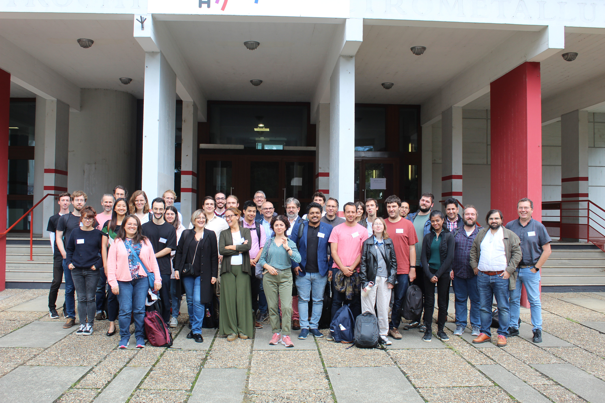

## Machine Learning Interatomic Potentials and Accessible Databases

### <a href="https://www.cecam.org/workshop-details/machine-learning-interatomic-potentials-and-accessible-databases-1313" class="d-flex">CECAM web page for the event</a>

### Organisers

- **Magali BENOIT** (CEMES, CNRS, Toulouse)
- **Arthur FRANCE-LANORD** (CNRS)
- **Noel JAKSE** (Université Grenoble Alpes)
- **Antonino MARCO SAITTA** (IMPMC - Université Pierre et Marie Curie (UPMC) - Paris)

Machine Learning Interatomic Potentials (MLIPs) have positioned themselves as a key tool for atomistic modeling in materials science. MLIPs cover an expansive range of systems, taking advantage of the highly accurate electronic structure calculations based on quantum mechanics, but at a significantly lower computational cost. They allow to scale up atomistic simulations to larger systems, longer timescales, and more complex phenomena; they therefore significantly contribute to the acceleration of the discovery of novel structural and functional materials, and in the advancements in our understanding of matter. Ground-breaking bodies of work have been published since the seminal work of Behler and Parrinello in 2007, transforming the field into a rapidly evolving research discipline. However, alongside these advancements, a crucial challenge emerges: the need for standardized protocols for MLIP generation and storage, as well as comprehensive, accessible databases for _ab initio_ datasets.

### Past event: download or view the presentation slides and event photos

#### Slides

- **Jörg BEHLER** <a href="/downloads/2024-09-CECAM-Workshop/slides-behler-2024-09-09-CECAM-workshop.pdf" target="_blank">The Cambrian Explosion of Machine Learning Potentials</a>
- **Martin UHRIN** <a href="/downloads/2024-09-CECAM-Workshop/slides-uhrin-2024-09-09-CECAM-workshop.pdf" target="_blank">Symmetry-aware models beyond energies and forces</a>
- **Johannes SANDBERG** <a href="/downloads/2024-09-CECAM-Workshop/slides-sandberg-2024-09-10-CECAM-workshop.pdf" target="_blank">Feature selection for neural network potentials with the adaptive group lasso</a>
- **François-Xavier COUDERT** <a href="/downloads/2024-09-CECAM-Workshop/slides-coudert-2024-09-10-CECAM-workshop.pdf" target="_blank">Data-based methods to accelerate discovery of novel materials and find new properties in old ones</a>
- **Julia YANG** <a href="/downloads/2024-09-CECAM-Workshop/slides-yang-2024-09-10-CECAM-workshop.pdf" target="_blank">Development of MLIP workflow for reactive, organic solvents</a>
- **Gian-Marco RIGNANESE** <a href="/downloads/2024-09-CECAM-Workshop/slides-rignanese-2024-09-11-CECAM-workshop.pdf" target="_blank">Systematic assessment of various universal machine-learning interatomic potentials</a>
- **Thierry DEUTSCH** <a href="/downloads/2024-09-CECAM-Workshop/slides-deutsch-2024-09-11-CECAM-workshop.pdf" target="_blank">Setting up data tools as part of the DIADEM program</a>
- **Kristjan EIMRE** <a href="/downloads/2024-09-CECAM-Workshop/slides-eimre-2024-09-11-CECAM-workshop.pdf" target="_blank">Generating and publishing datasets using AiiDA and Materials Cloud</a>

<h4 class="mb-n2"><a href="/downloads/2024-09-CECAM-Workshop/cecam-workshop-photos.zip" class="d-flex">Download photos from the event</a></h4>

Taken by Joao Paulo Almeida De Mendonca

 

<!-- **Location:** amphithéâtre Besson, campus Phelma, Batiment A, 1130 rue de la Piscine, 38400 Saint Martin d'Hères. Campus map <a href="https://dropsu.sorbonne-universite.fr/s/gdMJ2o5FZtKn48Z" target="_blank">here</a> (look for building A, Phelma campus):

How to reach the event? The airport shuttle will drop you at the Grenoble train station. From there, take tram B (towards "Gières, Plaine des Sports"), and stop at "Bibliothèques Universitaires". Walk north and reach Building A on the map.

**Follow remotely the presentations:**

[https://grenoble-inp.zoom.us/j/92354659113](https://grenoble-inp.zoom.us/j/92354659113)

Meeting ID: 923 5465 9113

Password: 968905 -->
