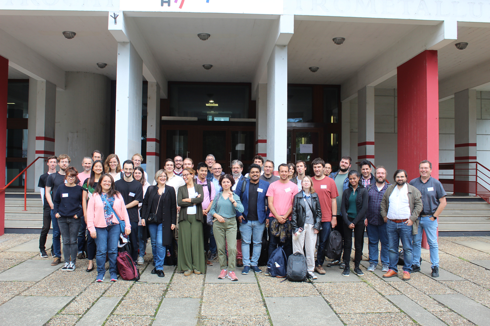

## Potentiels Interatomiques par Apprentissage Machine, et Bases de Données Accessibles

### <a href="https://www.cecam.org/workshop-details/machine-learning-interatomic-potentials-and-accessible-databases-1313" class="d-flex">Page CECAM de l'évènement</a>

### Organisateurs

- **Magali BENOIT** (CEMES, CNRS, Toulouse)
- **Arthur FRANCE-LANORD** (CNRS)
- **Noel JAKSE** (Université Grenoble Alpes)
- **Antonino MARCO SAITTA** (IMPMC - Université Pierre et Marie Curie (UPMC) - Paris)

Les potentiels interatomiques par apprentissage automatique (MLIPs) se sont imposés comme un outil clé pour la modélisation atomistique en science des matériaux. Les MLIPs couvrent un large éventail de systèmes, tirant parti des calculs très précis de structure électronique basés sur la mécanique quantique, mais à un coût computationnel nettement inférieur. Ils permettent d’étendre les simulations atomistiques à des systèmes plus grands, à des échelles de temps plus longues et à des phénomènes plus complexes, contribuant ainsi de manière significative à l’accélération de la découverte de nouveaux matériaux structurels et fonctionnels, ainsi qu’aux avancées dans notre compréhension de la matière. Des travaux révolutionnaires ont été publiés depuis les travaux fondateurs de Behler et Parrinello en 2007, transformant ce domaine en une discipline de recherche en évolution rapide. Cependant, parallèlement à ces avancées, un défi crucial se pose : la nécessité de protocoles standardisés pour la génération et le stockage des MLIPs, ainsi que de bases de données complètes et accessibles pour les ensembles de données *ab initio*.

### Évènement passé : téléchargez ou consultez les slides des présentations et les photos de l'évènement

#### Slides

- **Jörg BEHLER** <a href="/downloads/2024-09-CECAM-Workshop/slides-behler-2024-09-09-CECAM-workshop.pdf" target="_blank">The Cambrian Explosion of Machine Learning Potentials</a>
- **Martin UHRIN** <a href="/downloads/2024-09-CECAM-Workshop/slides-uhrin-2024-09-09-CECAM-workshop.pdf" target="_blank">Symmetry-aware models beyond energies and forces</a>
- **Johannes SANDBERG** <a href="/downloads/2024-09-CECAM-Workshop/slides-sandberg-2024-09-10-CECAM-workshop.pdf" target="_blank">Feature selection for neural network potentials with the adaptive group lasso</a>
- **François-Xavier COUDERT** <a href="/downloads/2024-09-CECAM-Workshop/slides-coudert-2024-09-10-CECAM-workshop.pdf" target="_blank">Data-based methods to accelerate discovery of novel materials and find new properties in old ones</a>
- **Julia YANG** <a href="/downloads/2024-09-CECAM-Workshop/slides-yang-2024-09-10-CECAM-workshop.pdf" target="_blank">Development of MLIP workflow for reactive, organic solvents</a>
- **Gian-Marco RIGNANESE** <a href="/downloads/2024-09-CECAM-Workshop/slides-rignanese-2024-09-11-CECAM-workshop.pdf" target="_blank">Systematic assessment of various universal machine-learning interatomic potentials</a>
- **Thierry DEUTSCH** <a href="/downloads/2024-09-CECAM-Workshop/slides-deutsch-2024-09-11-CECAM-workshop.pdf" target="_blank">Setting up data tools as part of the DIADEM program</a>
- **Kristjan EIMRE** <a href="/downloads/2024-09-CECAM-Workshop/slides-eimre-2024-09-11-CECAM-workshop.pdf" target="_blank">Generating and publishing datasets using AiiDA and Materials Cloud</a>

<h4 class="mb-n2"><a href="/downloads/2024-09-CECAM-Workshop/cecam-workshop-photos.zip" class="d-flex">Téléchargez les photos de l'évènement</a></h4>

Prises par Joao Paulo Almeida De Mendonca

 

<!-- **Adresse :** amphithéâtre Besson, campus Phelma, Batiment A, 1130 rue de la Piscine, 38400 Saint Martin d'Hères. <a href="https://dropsu.sorbonne-universite.fr/s/gdMJ2o5FZtKn48Z" target="_blank">Plan du campus</a> (cherchez le bâtiment A, campus Phelma):

**Comment se rendre à l'événement ?** La navette de l'aéroport vous déposera à la gare de Grenoble. De là, prenez le tram B (direction "Gières, Plaine des Sports") et descendez à l'arrêt "Bibliothèques Universitaires". Marchez vers le nord et atteignez le Bâtiment A sur la carte.

**Suivez les présentations à distance :**

[https://grenoble-inp.zoom.us/j/92354659113](https://grenoble-inp.zoom.us/j/92354659113)

ID réunion : 923 5465 9113

Mot de Passe : 968905 -->
