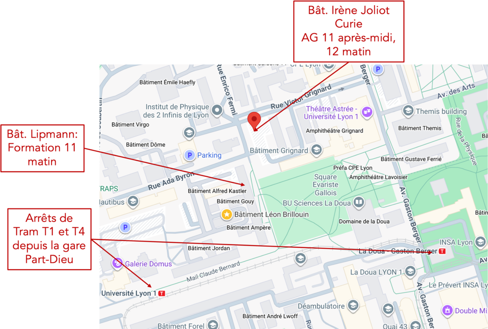
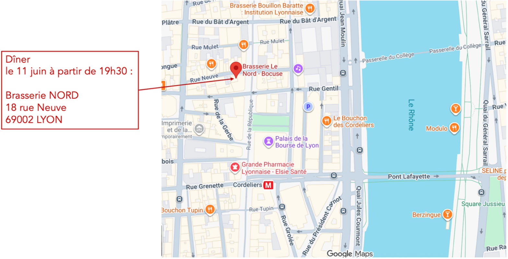

L'**Assemblée Générale 2026 du projet DIAMOND**, la plateforme numérique du PEPR DIADEM, se tiendra les **11 et 12 juin à Lyon**, sur le **campus de La Doua**.
Elle débutera le **jeudi 11 juin au matin** par une formation optionnelle à l'analyse de données en science des matériaux, et se clôturera le **vendredi 12 juin à 13h30**, après un déjeuner de clôture.
Un dîner en centre-ville est également prévu le soir du 11 juin.

## Lieu


**Campus LyonTech-la Doua** — Bâtiment Irène Joliot Curie, 3 rue Enrico Fermi, 69100 Villeurbanne



Trams **T1** et **T4** depuis la gare Part-Dieu — arrêts : *Université Lyon 1* ou *La Doua – Gaston Berger*


## Programme

### Jeudi 11 juin

- **9h00 – 11h30** — Formation : Analyse de données en science des matériaux *(Salle Anne-Marie JURDYC, Bât. Lippmann — animateurs : A. Amrani, J.-P. Poli, L. Orveillon)* [lien formation](https://gricad-gitlab.univ-grenoble-alpes.fr/diamond/jupyter/training-diamond-ag-2026)
- **12h00 – 13h30** — Buffet d'accueil
- **13h00 – 15h00** — Conférences invitées
  - **13h30 – 14h15** — Heiko WEBER (Friedrich-Alexander-Universität) — Projet FAIRmat
  - **14h15 – 15h00** — Tilmann HICKEL (BAM Federal Institute for Materials Research and Testing) — Projet NFDI-Matwerk
- **15h00 – 15h30** — Pause
- **15h30 – 18h15** — Avancement des Work Packages
  - **15h30 – 16h00** — WP0 — François WILLAIME (CEA Paris-Saclay)
  - **16h00 – 16h45** — WP1 — David RODNEY (ILM, Lyon)
  - **16h45 – 17h30** — WP2 — Thierry DEUTSCH (CEA Grenoble)
  - **17h30 – 18h15** — WP3 — Marco SAITTA (Sorbonne Université, Paris)
- **19h30** — Dîner en centre-ville


**Dîner — 11 juin à partir de 19h30** — Brasserie NORD, 18 rue Neuve, 69002 Lyon


### Vendredi 12 juin

- **9h00 – 10h45** — Présentations flash des CDD *(16 × 5 min)*

<ol style="columns: 2; column-gap: 3rem; margin-left: 2rem; margin-bottom: 1rem;">
<li>Aadhityan Arivazhagan</li>
<li>Akshay Ammothum Kandy</li>
<li>May Choueib</li>
<li>Cinthya Herrera-Contreras</li>
<li>Étienne Polack</li>
<li>Gabriele Cassetta</li>
<li>Joao Paulo Almeida de Mendonca</li>
<li>Karim Aït Ammar</li>
<li>Nils Kasch</li>
<li>Léo Orveillon</li>
<li>Yaidel Toledo Gonzalez</li>
<li>Irina Piazza</li>
<li>Omar Benyaha</li>
<li>Sonia Salomoni</li>
<li>Yiran Lu</li>
<li>Anruo Zhong <em>(visio)</em></li>
</ol>

- **10h45 – 11h15** — Pause
- **11h15 – 12h15** — Présentations de cas d'usage
  - **11h15 – 11h35** — Projet ESRF — Loïc HUDER (ESRF, Grenoble)
  - **11h35 – 11h55** — Projet FASTNANO — David MUNOZ-ROJAS (LMGP, Grenoble)
  - **11h55 – 12h15** — Projet LIBELUL — Jérémie MARGUERITAT (ILM, Lyon)
- **12h15 – 13h30** — Buffet de clôture
