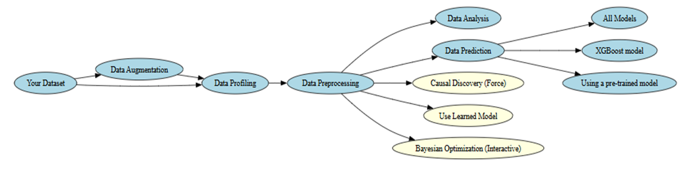
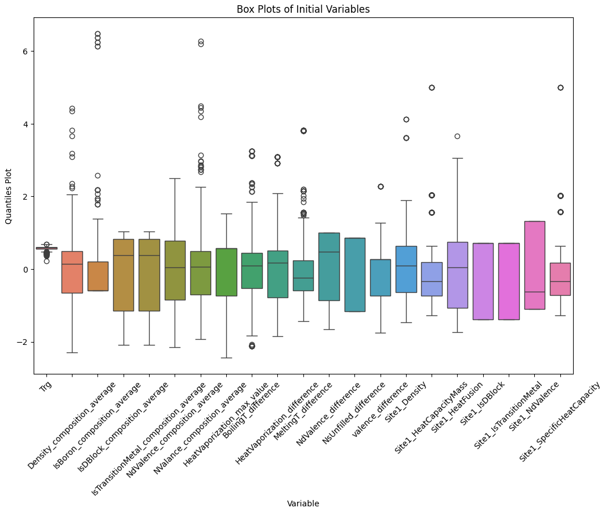
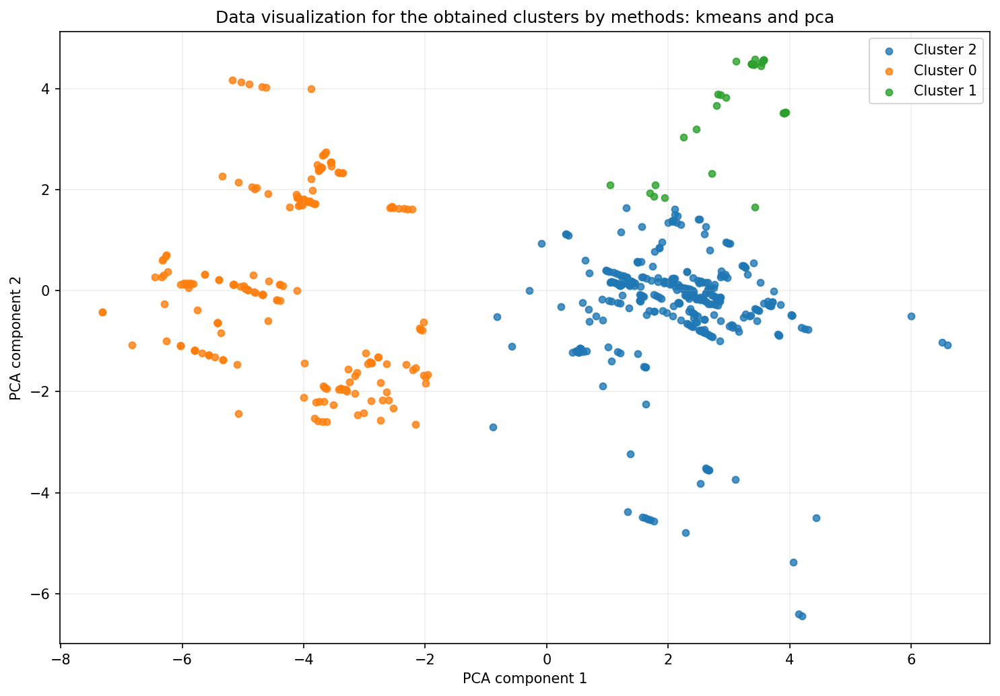
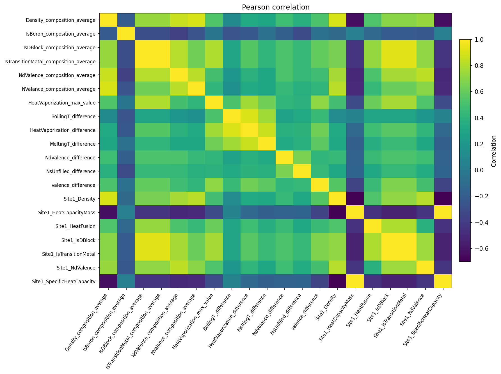
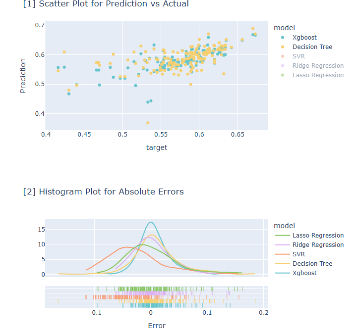
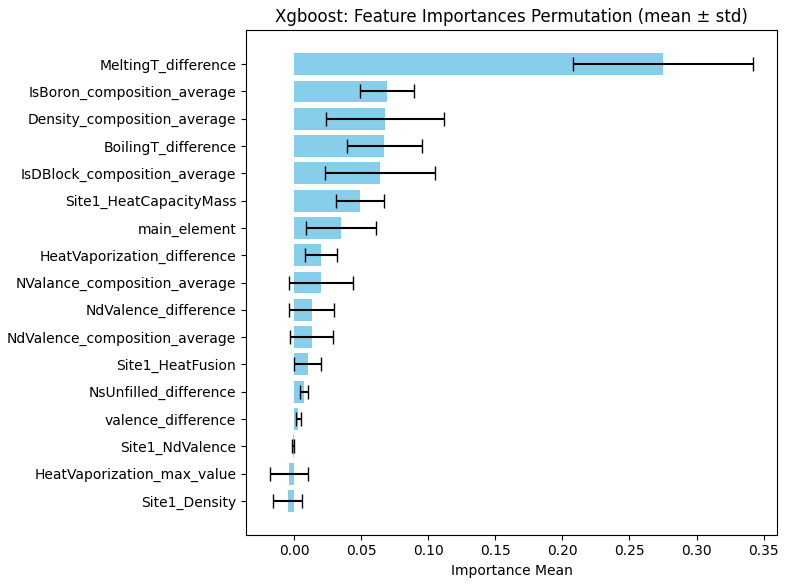
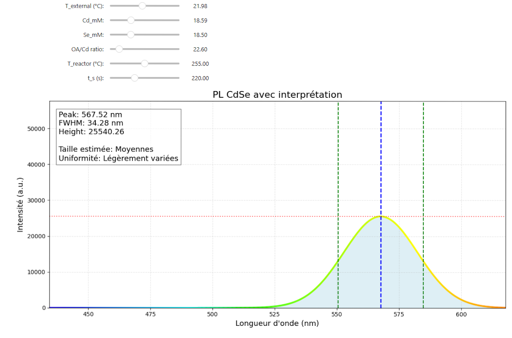
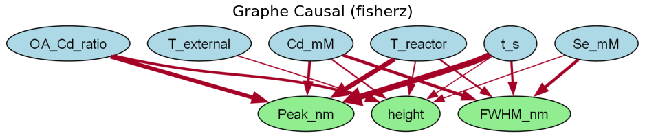
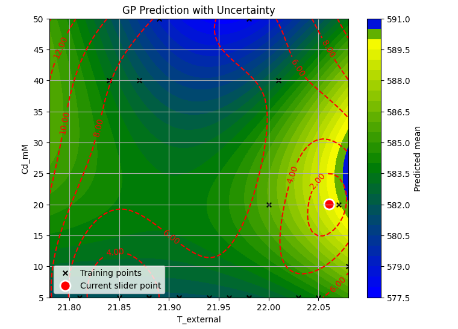



Educational notebooks to discover, step by step, how to apply ML methods to materials data.

These notebooks are training material (version 1.0). They illustrate a practical workflow, from understanding experimental data to building predictive models and exploring more advanced approaches. They are designed as a starting point that can be adapted to your own materials data. Results depend on the quality and size of the dataset, and the choices presented are guidelines rather than universal rules.

Most notebooks include the explanations and instructions needed to understand and run the proposed workflow. You can follow them as a complete learning path, or open a specific notebook directly when you are interested in a particular step or method.

The overall workflow is illustrated below. The first steps focus on data quality and understanding; the later branches introduce prediction, model reuse, causal discovery and Bayesian optimisation. Blue boxes are the steps of the workflow and yellow boxes are the applications. The diagram also shows an optional data augmentation step, which is not covered in this guide.

## A possible learning path

1. **Profile** the data to understand its characteristics and identify possible quality issues.
2. **Preprocess** the data by identifying missing values, duplicates and outliers, then export a processed dataset.
3. **Analyse** the structure of the data, or **predict** a material property with a model.
4. **Go further** with the CdSe nanocrystal case: model exploration, causal discovery and optimisation of experiments.

The notebooks can be followed in this order, but they are also designed to be useful independently. You can jump directly to the notebook that matches the question you want to investigate. The index notebook (`notebooks/index.ipynb`) links to the main notebooks.

## Before you start

You need one of the following: Apptainer, Docker, or Python 3.10+ with uv and Graphviz. Detailed instructions are available in the [tutorial repository](https://gricad-gitlab.univ-grenoble-alpes.fr/diamond/jupyter/training-diamond-ag-2026).

## Data quality

First step: check the quality of the starting dataset.

### Missing data and outliers

Notebook: `preprocessing.ipynb`

This notebook helps you spot data quality problems before analysis or modelling.

Steps:

1. Profile the dataset: dimensions, empty columns, columns with missing values and their percentage, duplicates, type and number of distinct values of each column.
2. Assign a treatment to each variable (numeric, categorical, identifier, target, or dropped from the dataset, for example if it is too incomplete), and choose whether or not to drop duplicated rows.
3. Detect outliers with box plots (bounds at 1.5 times the interquartile range) and with the Z-score: an adjustable threshold shows, on two variables of your choice, the flagged points and the list of rows concerned.
4. Export a processed CSV, deciding at that point whether or not to drop the outlier rows. Nothing is dropped before then.



An outlier is not necessarily an error: it may be a genuine measurement. Look at the flagged rows before deciding to remove them.



[View in the repository](https://gricad-gitlab.univ-grenoble-alpes.fr/diamond/jupyter/training-diamond-ag-2026)

## Exploring and understanding

Getting a first idea of the structure of the data, without trying to predict a target.

### Explore and group the data

Notebook: `analysis.ipynb`

An introduction to a few unsupervised methods: correlations, dimensionality reduction and clustering.

Steps:

1. Profile the dataset.
2. Compute the correlations and read them on the heatmap.

   

3. Reduce the dimension with a principal component analysis (PCA): follow the cumulative explained variance and choose the number of components according to a threshold, for example 90 or 95%.
4. Try a clustering method (K-Means, agglomerative or DBSCAN) and adjust its hyperparameters.
5. Project the groups, compare their centres, then export the data with a cluster identifier column.

**Example.** Notice that two strongly correlated variables carry almost the same information, then check with PCA whether a few components are enough to represent the dataset.



Clusters depend on the method and its settings: compare several methods rather than treating one result as final.



[View in the repository](https://gricad-gitlab.univ-grenoble-alpes.fr/diamond/jupyter/training-diamond-ag-2026)

## Predicting a property

Relating a target variable to explanatory variables, or reusing an already saved model.

### Build and compare regression models

Notebook: `modeling_all.ipynb`

A guide to predicting a continuous variable with several algorithms and comparing their results. Each algorithm comes with hints on when to consider it.

Steps:

1. Load the data, assign the roles and choose the target.
2. Split a training set and a test set.
3. Choose algorithms according to the nature of the data: XGBoost, decision tree, SVR, Ridge, Lasso. Adjust their hyperparameters.
4. Evaluate with MAE, MSE, RMSE, R² and MAPE, and read the predicted-versus-actual scatter plot and the error distribution.
5. Export the selected models.

**Example.** On a dataset where the relationship looks linear and the variables are correlated, compare Ridge or Lasso with XGBoost. The export can be named by version and dataset, such as `models_V01_metallic_glass`.



Choosing a model remains an empirical comparison: the hints given are guidelines.



[View in the repository](https://gricad-gitlab.univ-grenoble-alpes.fr/diamond/jupyter/training-diamond-ag-2026)

### Take a closer look at XGBoost

Notebook: `modeling_xgboost.ipynb`

A closer look at XGBoost, which builds trees in sequence, each one correcting the errors of the previous ones, to understand the effect of its settings.

Steps:

1. Configure the dataset and the training/test split.
2. Set the hyperparameters: number of trees (typically 100 to 500), learning rate (0.1 to 0.3), maximum depth (3 to 10).
3. Train and evaluate on the training and test data.
4. Look at feature importance (weight, gain, cover, permutation) and at a few individual trees.
5. Run a grid search and compare with the default model.
6. Export the model.

**Example.** Compare the metrics of the default model and the optimised model to judge whether the grid search brings a noticeable gain on your dataset.



XGBoost grid search is not supported on Windows in local mode.



[View in the repository](https://gricad-gitlab.univ-grenoble-alpes.fr/diamond/jupyter/training-diamond-ag-2026)

### Use a pre-trained model

Notebook: `modeling_prediction.ipynb`

Shows how to reuse a model saved in `.pkl` format on new data, without retraining.

Steps:

1. Load the model (`.pkl`).
2. Load a dataset that provides the same input variables as the model.
3. Run the prediction and examine the plot of predicted values.
4. If the dataset contains the target, compare predictions and actual values with the regression metrics.
5. Save the dataset with the predictions column.

**Example.** Apply a model exported from a modelling notebook to a new batch of samples, checking that its input variables match.

[View in the repository](https://gricad-gitlab.univ-grenoble-alpes.fr/diamond/jupyter/training-diamond-ag-2026)

## Applications: CdSe nanocrystals

Notebooks that illustrate more advanced approaches on a concrete case. They are examples of an approach, to be transposed to your own systems. Retraining the models is possible but optional, and is described at the end of this section.

**The data.** Each sample links synthesis parameters to an optical response.

- **Inputs:** `T_external` (external temperature), `Cd_mM` and `Se_mM` (precursor concentrations), `OA_Cd_ratio` (ligand-to-metal ratio), `T_reactor` (growth temperature), `t_s` (reaction time).
- **Outputs:** `Peak_nm` (emission peak, related to the average size), `FWHM_nm` (spectral width, related to uniformity) and `height` (intensity).

### Explore the learned model

Notebook: `Use_Learned_Model.ipynb`

Loads pre-trained models and offers an interface to explore their predictions.



Steps:

1. Load the data and the two models (random forest, Gaussian process with its normalisations).
2. Choose the model in the menu.
3. Set the six synthesis parameters with the sliders or the numeric boxes.
4. Read the predicted peak, width and intensity, as well as the spectrum reconstructed as a Gaussian curve.

**Example.** Fix a combination of parameters, predict with the random forest and then with the Gaussian process, and compare the two spectra.

[View in the repository](https://gricad-gitlab.univ-grenoble-alpes.fr/diamond/jupyter/training-diamond-ag-2026)

### Discover causal relationships

Notebook: `Causal_Discovery_Force.ipynb`

A demonstration of causal discovery with the PC (Peter–Clark) algorithm, from observational data.



Steps:

1. Load the data (`CdSe_PL.csv` by default).
2. Label the variables: inputs, targets or ignored. If you do nothing, the default inputs are the six synthesis parameters and the outputs are the peak, the width and the intensity.
3. Subsample the dataset, with a fixed seed for reproducibility.
4. Set your prior knowledge: a property cannot influence a synthesis parameter, the parameters are assumed independent of each other, and the properties do not influence one another.
5. Choose the independence test, Fisher Z (linear) or KCI (nonlinear), and run the algorithm with a 0.05 threshold.
6. Read the graph: the thickness of an edge follows its strength, its colour follows its significance, with the p-value of each link.

**Example.** Compare the graphs obtained with Fisher Z and with KCI to see which links depend on the linearity assumption.



A graph obtained from observational data is a hypothesis to be checked against domain knowledge, not proof of causality.



[View in the repository](https://gricad-gitlab.univ-grenoble-alpes.fr/diamond/jupyter/training-diamond-ag-2026)

### Optimise experiments with Bayesian optimisation

Notebook: `Bayesian_Optimization_interactive_short.ipynb`

Illustrates the principle of Bayesian optimisation: a Gaussian process proposes the next conditions to test and updates itself with the measurements. It lends itself to teaching as well as to experimentation.



Steps:

1. Choose a CSV file, then select the input variables and the target.
2. Set, with the sliders, the bounds of each variable: the proposals stay within them.
3. Train the Gaussian process and examine its predictions with the ±1σ uncertainty band.
4. Choose the objective (maximise, minimise or reach a value) and adjust the trade-off between exploration and exploitation.
5. Request a point, enter the measurement obtained, validate, then repeat.
6. Follow the history and the convergence curve.

[View in the repository](https://gricad-gitlab.univ-grenoble-alpes.fr/diamond/jupyter/training-diamond-ag-2026)

### Optional: retrain the models

Notebook: `Learn_Models_RF_GP.ipynb`

_Explore the learned model_ uses models that have already been trained. If you want to understand how they are built, or rebuild them, this notebook trains a multi-output random forest and a Gaussian process with a Matérn kernel on the CdSe data, then saves the models with their normalisations. It is not required to follow the rest.

[View in the repository](https://gricad-gitlab.univ-grenoble-alpes.fr/diamond/jupyter/training-diamond-ag-2026)
